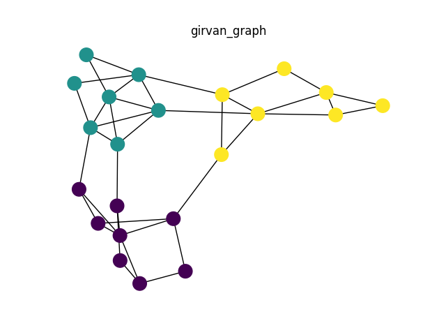

# Community Scanner

Detects communities in graphs using Girvan-Newman community detection algorithm. 

This project uses Djkistra's algorithm to find single source shortest paths necessary to calculate the betweennes centrality of the edges in the graph.

This is a sequential implementation from scratch using python primitives. The data structures of this project are used in the distributed implementation, which uses a in-memmory distributed data processing engine to perform big data analytics on large graphs.

## Usage

1. Create and activate virtual environment
    
```
python3 -m venv venv
source venv/bin/activate
```
    
2. Install required python packages
    
```
pip install -r requirements.txt
```
    
3. Run community detection algorithm for sample graph in Girvan-Newman paper:
    
```
python community_scanner.py sample_files/girvan_graph.csv
```

If the configuration flag DRAW (in config.py file) is set to True, the following plot will be displayed:



Also, the nodes of each community will be displayed in the console after the benchmarking data:
```
Edges: 38;		Target Level: 3;			Sequential Computing Time (seconds): 0.023710966110229492

({1, 2, 3, 4, 5, 6, 7, 8}, {16, 17, 18, 19, 20, 21, 22}, {9, 10, 11, 12, 13, 14, 15})
```

## Internal Data Structures

**Graph**

List of edges. It is loaded in memory as an adjacency list.

    [(source_node, target_node, weight)]
    
    source,target,weight
    1,6,1
    1,8,1
    2,3,1
    2,4,1

**Paths**

    {target: [path]}
    path = [node]

    {1: [[1]], 2: [[1, 2], [1, 3, 2]], 3: [[1, 3]], 4: [[1, 2, 4], [1, 3, 2, 4]], 5: [[1, 2, 4, 5], [1, 3, 2, 4, 5]], 6: [[1, 2, 4, 6], [1, 3, 2, 4, 6], [1, 2, 4, 5, 6], [1, 3, 2, 4, 5, 6], [1, 2, 4, 7, 6], [1, 3, 2, 4, 7, 6]], 7: [[1, 2, 4, 7], [1, 3, 2, 4, 7]], 8: []}


**Edges count map**:

contains count of shortest paths to this target through this edge
 
    {target: {edge: edge_count}}
    
    {1: {}, 2: {(1, 2): 1.0, (3, 2): 1.0, (1, 3): 1.0}, 3: {(1, 3): 1.0}, 4: {(1, 2): 1.0, (3, 2): 1.0, (1, 3): 1.0, (2, 4): 2.0}, 5: {(1, 2): 1.0, (4, 5): 2.0, (3, 2): 1.0, (1, 3): 1.0, (2, 4): 2.0}, 6: {(1, 2): 3.0, (5, 6): 2.0, (3, 2): 3.0, (1, 3): 3.0, (4, 6): 2.0, (4, 5): 2.0, (7, 6): 2.0, (2, 4): 6.0, (4, 7): 2.0}, 7: {(1, 2): 1.0, (4, 7): 2.0, (1, 3): 1.0, (3, 2): 1.0, (2, 4): 2.0}, 8: {}}

Obtained from:
- paths

**Path count map**:

    {target: path_count}
    
    {1: 1, 2: 2, 3: 1, 4: 2, 5: 2, 6: 6, 7: 2, 8: 0}

Calculated from:
- paths 

**Betweenness**:

Dictionary of edges and betweenness value (float)

    {egdge: betweennes_value}
    
    {(1, 2): 2.5, (5, 6): 0.3333333333333333, (4, 7): 1.3333333333333333, (1, 3): 3.5, (2, 3): 2.5, (4, 6): 0.3333333333333333, (4, 5): 1.3333333333333333, (6, 7): 0.3333333333333333, (2, 4): 4.0}

It is calculated iteratively for each source:
- path_count_map (single source)
- edges_count_map (single source)

**Communities**:

Set of node ids

    {node}
    {1,2,3} 

**Components**:

Tuple of communities

    (community)
    ({1, 2, 3}, {4, 6}, {5}, {7}, {8})


## References

1. Girvan M. and Newman M. E. J., Community structure in social and biological networks, Proc. Natl. Acad. Sci. USA 99, 7821–7826 (2002).
2. Freeman, L., A Set of Measures of Centrality Based on Betweenness, Sociometry 40, 35–41  (1977).
3. E. W. Dijkstra, A note on two problems in connexion with graphs. Numerische Mathematik, 1:269–
271, (1959)
4. GitHub - networkx/networkx: Official NetworkX source code repository, https://github.com/networkx/networkx
